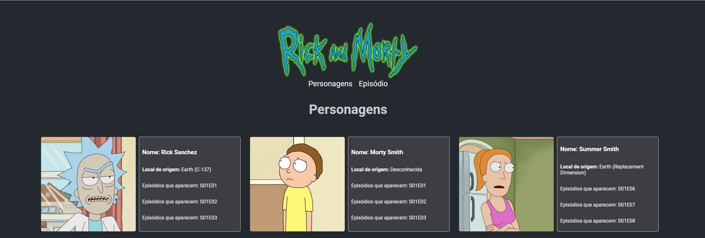

# Teste Frontend




Repositório criado com o objetivo de passar em uma entrevista.

## Tecnólogias

ReactJs 
MaterialUI
Styled-Components
Graphql
ApolloClient
React Icons

## API

URL: https://rickandmortyapi.com/graphql

## Instalação

Você precisará ter apenas o [NodeJS](https://nodejs.org) instalado na sua máquina, e após isso, clonar este repositório:
```sh
  $ git clone https://github.com/Bruno-Goudric/teste_frontend.git
```

Depois disso acesse a pasta do projeto que você deseja e instale as dependências executando o seguinte comando:
```sh
  $ yarn install  ou npm install
```

## Executando a aplicação

Execute o comando a baixo para inicializar a aplicação:
```sh
  $ yarn start  ou npm start
```

